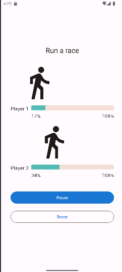

# Application de suivi de course

## Description

L'application de suivi de course simule la progression de deux participants à une course. L'idée est de démontrer les concepts de base des coroutines Kotlin. Un utilisateur peut démarrer, mettre en pause ou réinitialiser la course à l'aide des boutons dans l'interface utilisateur.

## Fonctionnalités

- Suivi de la progression des participants à la course
- Possibilité de démarrer, mettre en pause et réinitialiser la course
- Animation des icônes des participants se déplaçant en fonction de leur progression

## Comment ça marche

Chaque participant à la course est représenté par une instance de la classe `RaceParticipant`, qui a une méthode `run()` qui simule la course. Cette méthode utilise une boucle pour augmenter progressivement la progression du participant. Chaque itération de la boucle représente un pas dans la course. La boucle s'exécute jusqu'à ce que la progression du participant atteigne la progression maximale.

La méthode `run()` est suspendue pendant un certain temps à chaque itération de la boucle. Cela est fait en utilisant la fonction `delay()` de Kotlin, qui est une fonction de suspension. Cela signifie qu'elle suspend l'exécution de la coroutine pendant un certain temps sans bloquer le thread sur lequel elle s'exécute.

Dans la méthode `RaceTrackerApp()`, deux coroutines sont lancées pour exécuter les courses des deux participants en parallèle. Cela est fait en utilisant la fonction `launch()` de Kotlin, qui lance une nouvelle coroutine. Les deux coroutines sont lancées dans le même `coroutineScope`, ce qui signifie qu'elles peuvent s'exécuter en parallèle.

Lorsque les deux coroutines ont terminé, la variable `raceInProgress` est définie sur `false`, ce qui indique que la course est terminée.

## Captures d'écran

## Prérequis

- Expérience avec la construction d'applications en utilisant Jetpack Compose.
- Savoir comment créer et exécuter un projet dans Android Studio.
- Familiarité avec les coroutines Kotlin.

## Comment démarrer

1. Installez Android Studio, si vous ne l'avez pas déjà.
2. Téléchargez l'échantillon.
3. Importez l'échantillon dans Android Studio.
4. Construisez et exécutez l'échantillon.
